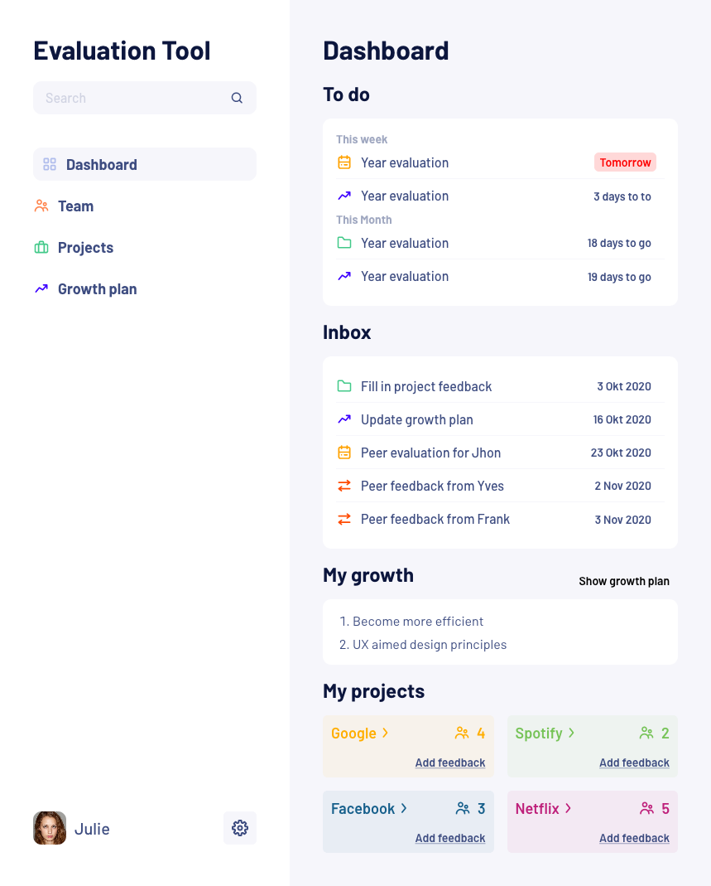
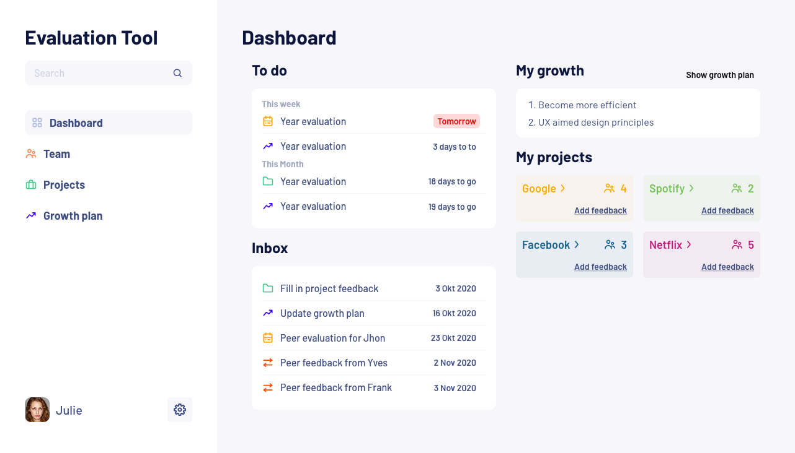

# Projectify tool

## Intro

> **Designs provided by Digiti.be**

Given a Figma design I converted the design in a (semi) responsive front-end layout with future integrations in mind. Since the designs heavily indicated the project being an application I chose for the React library. React allows us to quickly create a proof of concept from design and easily allows us to expand the application later by adding `react-router-dom` and/or state management libraries.

## Screenshots

## Starting the project

### 🖥 Running the application

`git clone https://github.com/NielsPeeters/projectify-tool.git`
`cd projectify-tool`

`yarn start` runs the app in the development mode. 
Open [http://localhost:3000](http://localhost:3000) to view it in the browser.

The page will reload if you make edits. 
You will also see any lint errors in the console.

### 🧪 Testing

> ⚠️ No tests written yet

`yarn test` launches the test runner in the interactive watch mode. 
See the section about [running tests](https://facebook.github.io/create-react-app/docs/running-tests) for more information.

### 🛠 Building

`yarn build` builds the app for production to the `build` folder. 
It correctly bundles React in production mode and optimizes the build for the best performance.

The build is minified and the filenames include the hashes. 
Your app is ready to be deployed!

See the section about [deployment](https://facebook.github.io/create-react-app/docs/deployment) for more information.

## Todo

- [ ] List Item progressbar
  - get box size & interpolate it to fill
- [ ] Promise mock data loading
- [ ] Revert inbox date order
